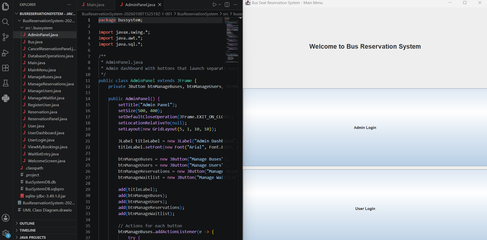

<h1 align="center">
  <br/>
  🚍 Bus Reservation System
  <br/>
</h1>

<h4 align="center">A Java-Based Desktop Application for Bus Booking and Management.</h4>

<p align="center"><em>Simple. Efficient. Organized Travel Management.</em></p>

<p align="center">
  
</p>

---

## 🚀 Overview

**Bus Reservation System** is a Java-based desktop application developed to manage bus reservations, users, routes, and administrative operations efficiently.

The system provides separate functionalities for administrators and passengers, allowing users to view available buses, reserve seats, manage bookings, and handle travel-related operations through a simple graphical user interface.

Built using **Java Swing**, **Object-Oriented Programming concepts**, and **SQLite database integration**, this project demonstrates a complete CRUD-based reservation management system.

---

## ✨ Features

### 👨‍💼 Admin Dashboard

- **Admin Login System**
  - Secure administrator authentication
  - Access control for management functions

- **Bus Management**
  - Add new buses
  - Update bus information
  - Delete bus records
  - Manage bus routes and details

- **User Management**
  - View registered users
  - Manage customer accounts

- **Reservation Management**
  - View reservations
  - Manage passenger bookings
  - Monitor seat availability

- **Waitlist Management**
  - Handle unavailable seat requests
  - Manage waiting passengers

---

### 👤 User Features

- **User Registration**
  - Create new passenger accounts

- **User Login**
  - Secure user authentication

- **Bus Search & Reservation**
  - View available buses
  - Select travel options
  - Reserve seats

- **Booking Management**
  - View previous bookings
  - Cancel reservations

---

## 🛠️ Tech Stack

| Layer | Technology |
|---|---|
| **Programming Language** | Java |
| **GUI Framework** | Java Swing |
| **Database** | SQLite |
| **IDE** | Eclipse |
| **Architecture** | Object-Oriented Programming |
| **Database Connectivity** | JDBC |

---

## ⚡ Getting Started

### Prerequisites

- Java Development Kit (JDK 8 or above)
- Eclipse IDE
- SQLite JDBC Driver

---

### Installation

1. **Clone the repository**

```bash
git clone https://github.com/your-username/bus-reservation-system.git
```

2. **Open Project in Eclipse**

- Launch Eclipse IDE
- Select:

```
File → Import → Existing Java Project
```

- Choose the project folder

---

3. **Add Database Driver**

Add the SQLite JDBC library:

```
sqlite-jdbc.jar
```

to the project build path.

---

4. **Run the Application**

Run:

```
Main.java
```

The application will launch the Bus Reservation System interface.

---

## 📂 Project Structure

```
BusReservationSystem/
│
├── src/
│   └── bussystem/
│       │
│       ├── Main.java
│       ├── MainMenu.java
│       ├── WelcomeScreen.java
│       │
│       ├── AdminLogin.java
│       ├── AdminDashboard.java
│       ├── AdminPanel.java
│       │
│       ├── UserLogin.java
│       ├── UserDashboard.java
│       ├── RegisterUser.java
│       │
│       ├── Bus.java
│       ├── Reservation.java
│       ├── ReservationPanel.java
│       │
│       ├── ManageBuses.java
│       ├── ManageUsers.java
│       ├── ManageReservations.java
│       ├── ManageWaitlist.java
│       │
│       ├── CancelReservationPanel.java
│       ├── ViewMyBookings.java
│       ├── WaitlistEntry.java
│       │
│       └── DatabaseOperations.java
│
├── BusSystemDB.db
├── sqlite-jdbc.jar
└── README.md
```

---

## 🗄️ Database Modules

The system stores and manages:

- User Details
- Bus Information
- Routes
- Reservations
- Seat Availability
- Waitlist Records

Database operations are handled through JDBC connectivity with SQLite.

---

## 🎯 Objectives

- Automate bus reservation processes
- Reduce manual booking errors
- Maintain organized passenger records
- Provide easy management tools for administrators
- Demonstrate Java GUI and database integration

---

## 📄 License

This project is developed for educational purposes.

---

<p align="center">
Built with ☕ by <a href="https://github.com/IleeshaUdari"><strong>M.G.Ileesha Udari Sasmitha</strong></a>
</p>
